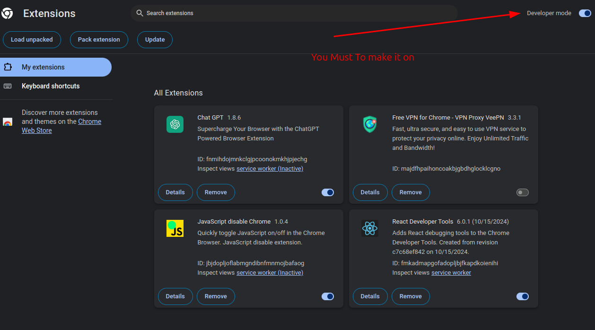
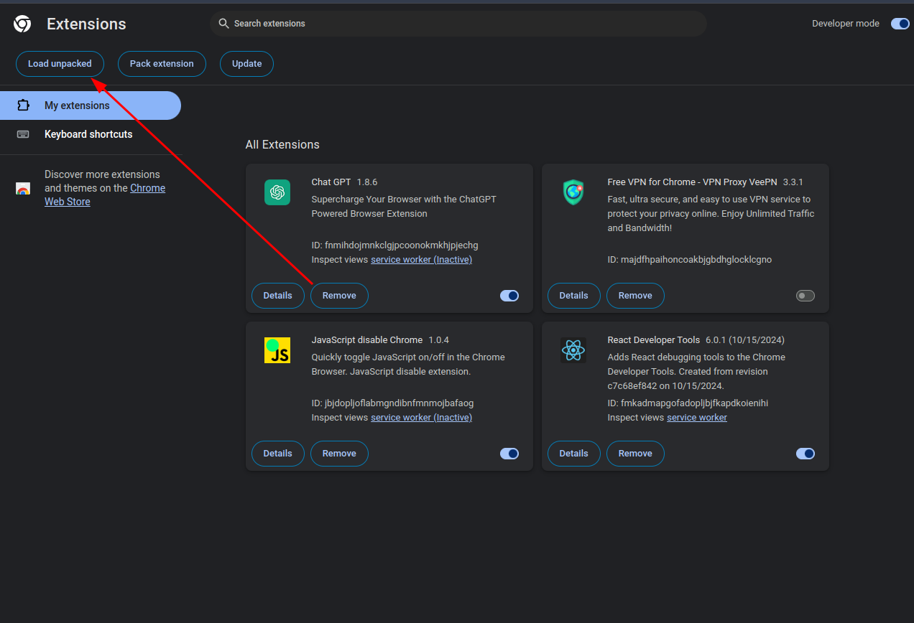
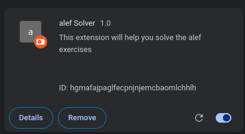

# Alef Solver 🚀

A personal project designed to handle and answer questions quickly and effectively. This solution was created to overcome challenges with dynamic web pages where traditional bot approaches struggled.

**Important Note**:  
`This does not work on all question types`. Currently unsupported formats include:

- **Select Questions**
- **Image-Based Questions**
- **Listing Questions**

🛠 _Support for these question types might be added in the future - stay tuned!_ 👀

---

## Installation Guide ⚙️

**Currently compatible with Chromium-based browsers**  
_(Firefox support pending verification)_

### 1. Clone Repository

```bash
git clone https://github.com/alballa3/alef-solver.git
```

### 2. Install Dependencies

```bash
npm install
```

## 3. Browser Setup

Open your browser's extensions page

Enable Developer Mode


Click Load Unpacked
Load Unpacked Extension


Select the cloned directory

Confirm successful installation


## Usage 🚦

Copy question text from supported formats

Paste into your preferred AI assistant
Recommended options: **DeepSeek , ChatGPT**

You're ready to go!
